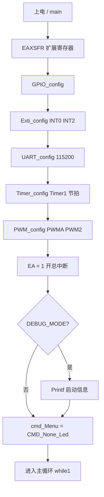
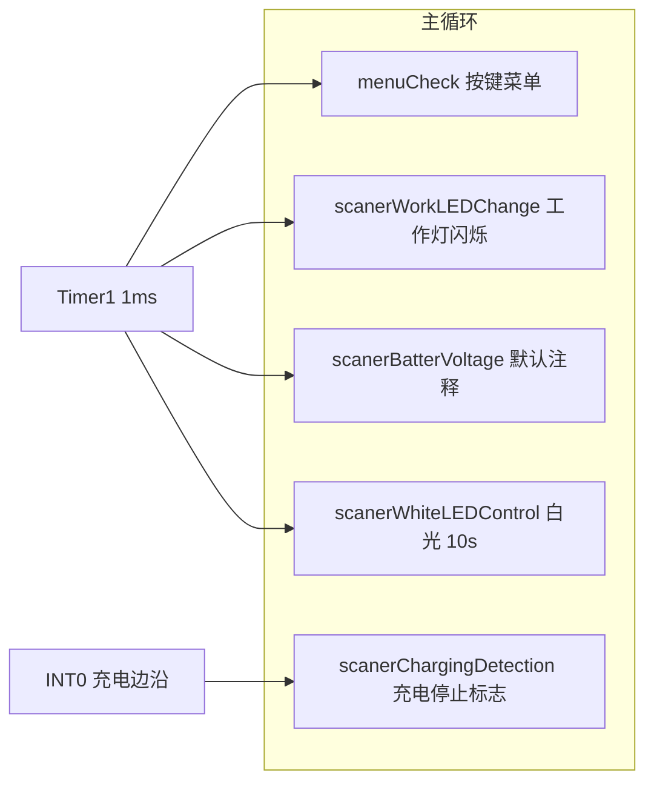
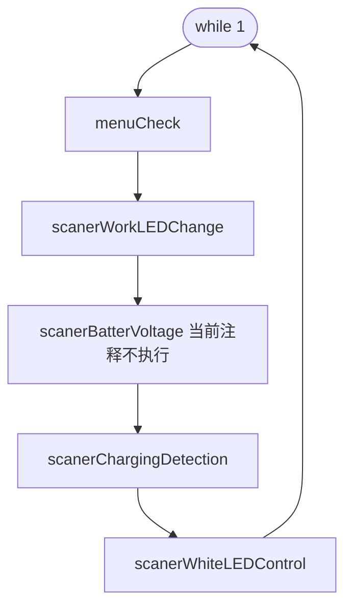
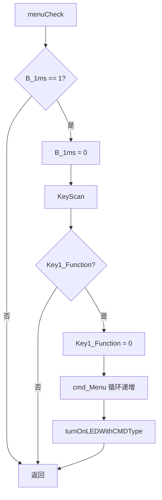
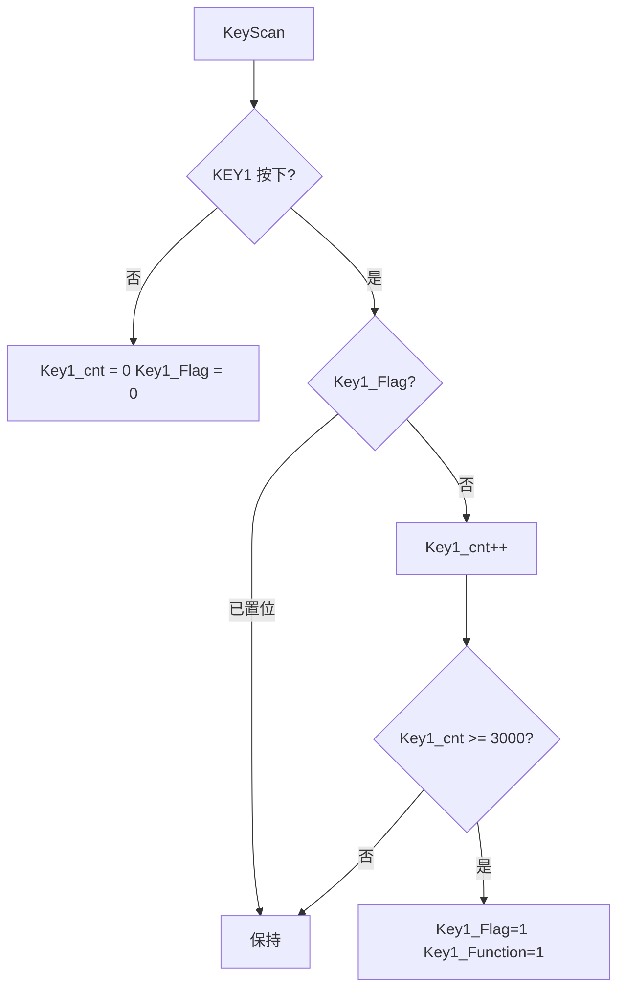
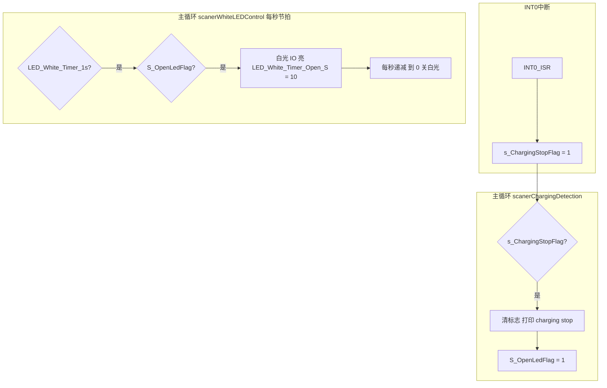
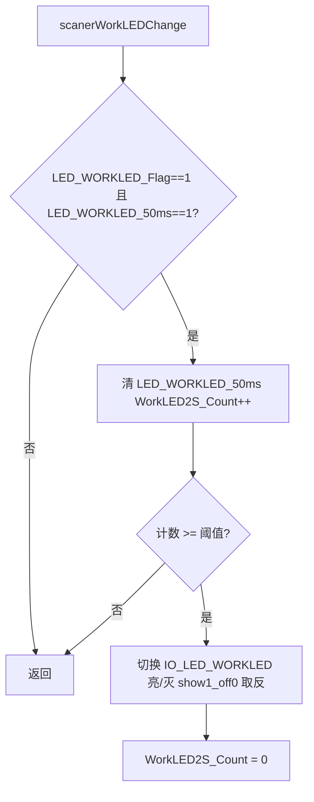
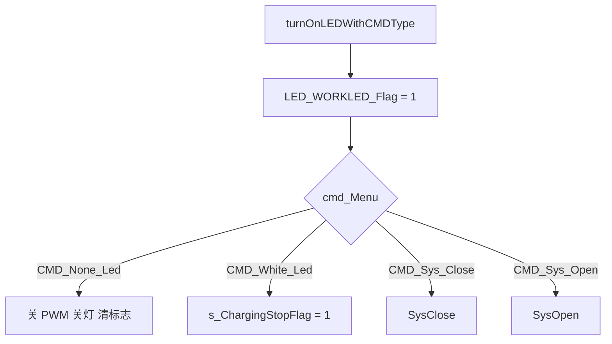
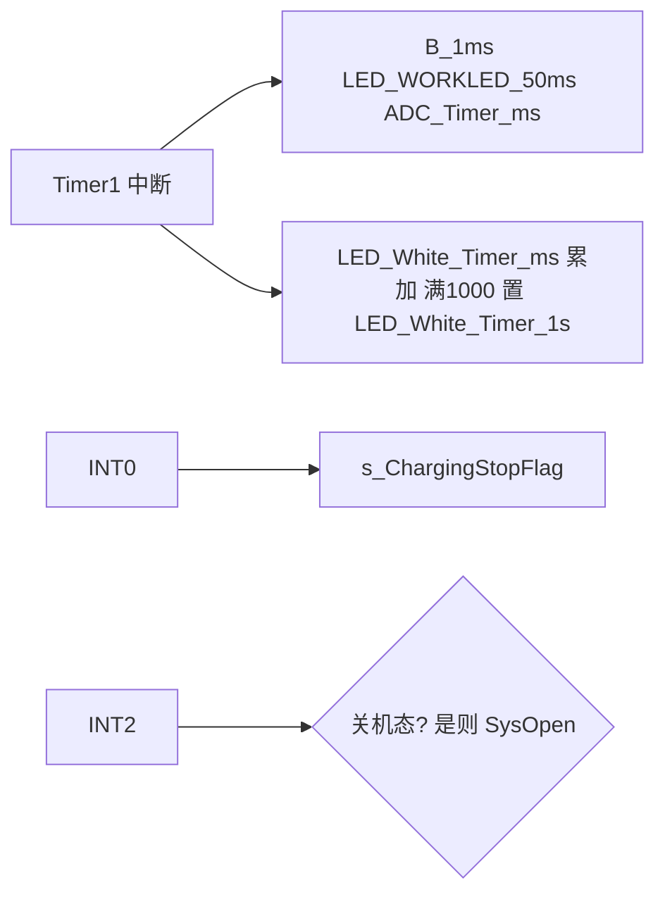
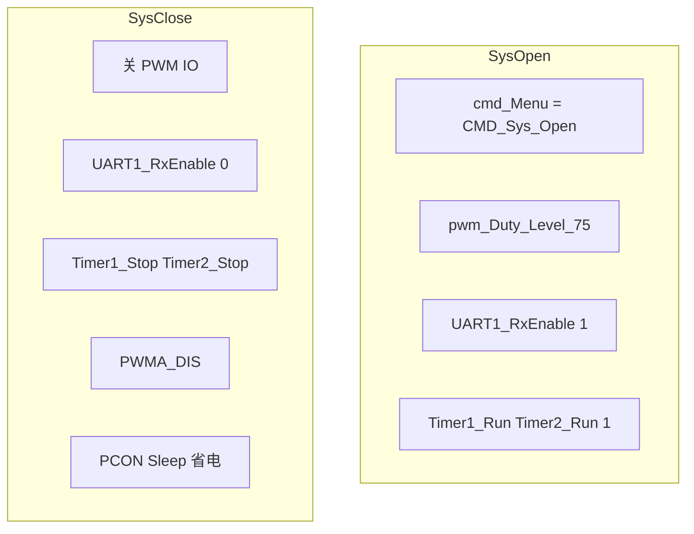

# FireLamp 固件技术方案说明

> 基于 `FireLamp/main.c`、`config.h` 及配套驱动整理。主控：STC8H 系列（接线标注 STC8H17K）。

## 目录

1. [概述](#1-概述)
2. [系统与资源](#2-系统与资源)
3. [硬件引脚与功能](#3-硬件引脚与功能)
4. [软件模块划分](#4-软件模块划分)
5. [总体流程](#5-总体流程)
6. [主循环与任务流程](#6-主循环与任务流程)
7. [命令菜单与按键](#7-命令菜单与按键)
8. [中断与时序](#8-中断与时序)
9. [系统开关](#9-系统开关)
10. [电量显示](#10-电量显示)
11. [PWM 亮度](#11-pwm-亮度)
12. [实现与文档差异](#12-实现与文档差异)

---

## 1. 概述

本方案为 **户外/便携灯具控制固件**，在 `FireLamp` 工程中实现：GPIO 驱动多路 LED、PWM 调光、外部中断检测充电与按键、定时器 1ms 节拍任务、串口调试输出，以及可选的电池 ADC 采样与分级显示。

---

## 2. 系统与资源

| 项目 | 说明 |
|------|------|
| 主频 | `MAIN_Fosc = 22118400 Hz`（`config.h`），下载/仿真需与工程一致 |
| 调试宏 | `DEBUG_MODE`：为 1 时上电打印启动信息、电池采样调试串口输出等 |
| 扩展寄存器 | `main()` 入口调用 `EAXSFR()` |

---

## 3. 硬件引脚与功能

与 `main.c` 头部接线说明一致。

**P1**

| 引脚 | 符号 | 说明 |
|------|------|------|
| P1.0～P1.1 | BAT_POW_LED1/2 | 电量格 LED，**低电平亮** |
| P1.3 | IO_LED_White | 白光开关（推挽） |
| P1.4～P1.5 | BAT_POW_LED3/4 | 电量格 LED |
| P1.6 / P1.7 | LogUART2 Rx/Tx | 调试串口（代码为 `UART1` + `UART1_SW_P16_P17`） |

**P3**

| 引脚 | 符号 | 说明 |
|------|------|------|
| P3.2 | IO_IN_Charging | 充电状态（高阻），**INT0** |
| P3.3 | IO_LED_WORKLED | 工作指示灯，低电平=工作中 |
| P3.4 | IO_LED_ERR | 异常指示（低电平亮） |
| P3.5 | ADC_BAT | 电池电压 `ADC_CH13` |
| P3.6 | KEY1 | 主菜单键，**INT2** |

---

## 4. 软件模块划分

| 模块 | 作用 |
|------|------|
| `GPIO_config` | P3 高阻输入+上拉；P1 推挽/双向；工作灯初始为关 |
| `Exti_config` | INT0、INT2 下降沿；NVIC 配置 |
| `UART_config` | 115200 8N1，Timer2 波特率；`UART1` → P1.6/P1.7 |
| `Timer_config` | Timer1：1T 自动重装，约 1 kHz 节拍 |
| `PWM_config` | PWMA + PWM2，周期 `PWMPeriod`，映射 `PWM2_SW_P12_P13`；初始化后关闭 `PWMA_ENO` |

ADC 初始化在 `main()` 中为注释状态，与主循环中 `scanerBatterVoltage()` 被注释一致。

---

## 5. 总体流程

### 5.1 上电初始化流程

### 5.2 主循环任务关系（数据流）

---

## 6. 主循环与任务流程

### 6.1 主循环顺序

### 6.2 菜单与按键 `menuCheck`

### 6.3 `KeyScan` 短按判定

### 6.4 充电停止与白光 10 秒

### 6.5 工作指示灯慢闪 `scanerWorkLEDChange`

---

## 7. 命令菜单与按键

**`enum CMDMenu`**：`CMD_None_Led` → `CMD_White_Led` → `CMD_Sys_Close` → `CMD_Sys_Open`，短按 `KEY1` 在 `menuCheck` 中循环递增。

### 7.1 `turnOnLEDWithCMDType` 分支

**INT2**：若 `cmd_Menu == CMD_Sys_Close`，则置 `CMD_Sys_Open` 并调用 `SysOpen()`，用于关机态唤醒。

---

## 8. 中断与时序

### 8.1 中断源一览

| 中断源 | 作用 |
|--------|------|
| Timer1 | `B_1ms`；`LED_WORKLED_50ms`；`ADC_Timer_ms`；`LED_White_Timer_ms` → 每 1000 次置 `LED_White_Timer_1s` |
| INT0 | `s_ChargingStopFlag = 1` |
| INT2 | 关机态唤醒 `SysOpen()` |

---

## 9. 系统开关

---

## 10. 电量显示

`displayBatterPower(float inVol)` 按电压分档（0～4 级），通过 **低电平亮** 的 4 个电量 LED 做条形显示（`switch` 贯穿点亮多格）。

**注意**：主循环中 **`scanerBatterVoltage()` 被注释** 时，不会周期性采样 ADC 与更新电量灯。使能时需同时打开 `ADC_config` 与主循环调用。

---

## 11. PWM 亮度

`setPWMWithLEDBrightness(enum PWMDutyLevel)` 将档位映射为 `PWMPeriod` 的比例占空比，并调用 `PWMA_Duty2` 更新。`SysOpen()` 中默认 `PWM_Duty_Level_75`。

---

## 12. 实现与文档差异

| 项目 | 说明 |
|------|------|
| 串口命名 | 注释写 UART2，实现为 `UART1` + `UART1_SW`，以 **P1.6/P1.7、115200** 为准 |
| Timer1 频率 | 重装值按 `MAIN_Fosc/50000` 计算，与注释“1000 Hz”需按数据手册核对 |
| 电池采样 | `ADC_config` 与 `scanerBatterVoltage()` 默认关闭；电压公式为示例，量产前需标定分压与参考 |
| 亮度键 | 文件头历史注释提到亮度键，本 `main.c` 未实现独立亮度键扫描 |

---

## 文档修订

| 版本 | 日期 | 说明 |
|------|------|------|
| 0.1 | 2024-04-01 | 源码头注释日期 |
| 文档 | — | 结合流程图整理技术方案 |
